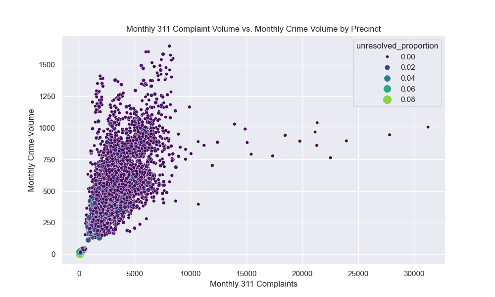
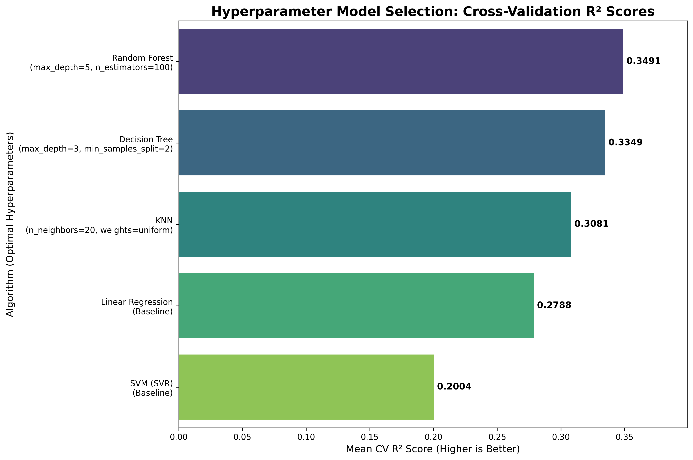
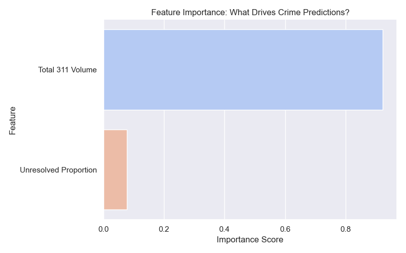

# Urban Pulse NYC

Urban Pulse NYC is an analytical pipeline that models the relationship between civic engagement (311 service requests) and monthly crime volume across NYC Police Precincts. Our analysis proves that the **volume** of monthly 311 complaints is the strongest predictor of neighborhood crime rates.

### Datasets

* [NYPD Complaint Data Historic](https://drive.google.com/file/d/1c1P43ba6sPn_11zNGfYZd1q2o2SjS_1b/view?usp=sharing)
* [311 Service Requests from 2020 to Present](https://drive.google.com/file/d/1OM8vJCHGGApUt8C6gGvEarbQKD39B-FH/view?usp=sharing)
* **Setup**: Please download these datasets and store them within your local repository folder for analysis.

## Project Structure & Setup Files

To ensure everything runs smoothly across all operating systems, our repository includes several important configuration files:

* **`requirements.txt`**: Lists all the Python libraries (pandas, scikit-learn, seaborn, etc.) needed to run our models. Install them all at once by running:
```bash
pip install -r requirements.txt
```
* **`.gitignore`** & **`.dockerignore`**: These files prevent Git and Docker from accidentally trying to process our massive 18GB raw datasets, temporary Python files, and the `output/` folder.
* **`.gitattributes`**: Resolves cross-platform Git LFS and line-ending (CRLF/LF) corruption issues between Windows and Mac users.

## Preprocessing & Data Aggregation

Before running any notebooks or models, you **must** run the preprocessing script to generate the aggregated dataset:
```bash
python preprocess_data.py
```
**What this does:**
1. Parses the massive raw 18GB datasets.
2. Extracts the `YYYY-MM` from the raw date strings.
3. Aggregates all data by both `Police Precinct` AND `YearMonth` to create a robust Monthly Time-Series dataset.
4. Generates a lightweight `preprocessed_data.csv` (4,620 rows) that is used to train our Random Forest Regressor model.

## Model Evaluation

To rigorously test which machine learning algorithm best predicts monthly crime volume, run the dedicated evaluation script:
```bash
python evaluate_models.py
```
**What this does:**
1. Loads `preprocessed_data.csv` and splits it into an 80% training set and a 20% holdout test set.
2. Uses `GridSearchCV` with 5-Fold Cross Validation to systematically test multiple algorithms: **Linear Regression, KNN, Decision Tree, Random Forest, and SVR**.
3. For each algorithm, it searches for the optimal hyperparameters that prevent both overfitting and underfitting.
4. Generates and saves `output/model_comparison_bar.png` — a labeled bar chart showing each algorithm's best Cross-Validation R² score alongside its winning hyperparameters.

> **Note:** This script is separate from `generate_report.py` by design. Model evaluation is a computationally heavy one-time analysis, while `generate_report.py` is your fast, daily pipeline.

## Key Project Visualizations

This project explores the hypothesis that neglected civic issues act as a precursor to crime.

### 1. The Relationship: 311 Volume vs Crime Volume

*This scatter plot shows the relationship between monthly 311 complaint volume and monthly crime volume per precinct. The data confirms that `total_311` has a strong positive correlation (r=0.53) with crime, while `unresolved_proportion` (shown by dot color/size) shows only a weak negative correlation (-0.19) and is not a strong predictor on its own.*

### 2. Hyperparameter Model Selection

*To ensure our predictive model generalizes well to unseen data, we tested multiple algorithms using 5-Fold Cross Validation. The Random Forest Regressor outperformed others, proving the relationship is threshold-based rather than strictly linear. The labels explicitly document the optimized hyperparameters to prevent overfitting.*

### 3. Feature Importance

*The Random Forest model internally scores how much each feature contributed to its predictions. Total 311 Volume accounts for 92.3% of the model's decision-making, mathematically confirming it as the dominant predictor of crime — not the unresolved proportion.*

## Docker Execution

To ensure this project is fully reproducible on any machine without needing to install Python libraries manually, we have containerized the automated report generation using Docker.

**Note:** You must run `python preprocess_data.py` locally to generate `preprocessed_data.csv` *before* building the Docker image. We explicitly block the raw 18GB CSV files from entering the Docker build context (via `.dockerignore`) to prevent your computer from freezing or crashing during the build.

To build and run the Docker container:

1. **Build the image:**
```bash
docker build -t urban-pulse-nyc .
```
2. **Run the container** (with a volume mount so the output files are saved to your local machine):

**Mac / Linux / Git Bash:**
```bash
docker run -v "$(pwd)/output:/app/output" urban-pulse-nyc
```
**Windows Command Prompt:**
```cmd
docker run -v "%cd%/output:/app/output" urban-pulse-nyc
```

The `-v` flag maps the container's internal `/app/output` folder directly to an `output/` folder in your current directory. Without it, the generated charts would be saved *inside* the container and lost when it stops.

When the container runs, it automatically executes the `generate_report.py` script. It will train the Random Forest model on the preprocessed data, evaluate it, and generate all final visualizations inside the container's `/output` folder.

## Contribution Guidelines

To keep the project organized and prevent merge conflicts, please follow this workflow:
* **No Direct Commits to `main`**: Always work on a separate branch.
* **Merging**: Once your program is tested and working, merge your branch into `main`.
* **Syncing**: Remember to `git pull` from `main` frequently to stay up to date with other group members.
